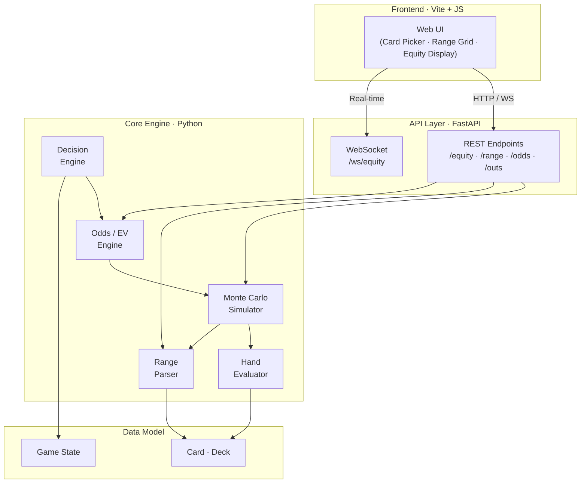

# 🃏 Poker Monte Carlo Equity Simulator

[](https://www.python.org/downloads/)
[](LICENSE)
[](https://github.com/psf/black)
[](https://github.com/astral-sh/ruff)
[](https://mypy-lang.org/)

A high-performance **Monte Carlo poker equity simulator** built from scratch in Python. Calculates win/tie/loss probabilities for Texas Hold'em (and Omaha) hands using randomized simulation — supporting hand-vs-hand, hand-vs-range, and range-vs-range analysis.

> **Why Monte Carlo?** Exact equity enumeration requires evaluating every possible board runout — up to 1.7 million combinations for a single preflop matchup. Monte Carlo simulation achieves near-exact accuracy in a fraction of the time by sampling thousands of random runouts and converging on the true equity.

---

## ✨ Features

- **Hand Evaluation Engine** — Custom lookup-table evaluator (Cactus Kev–style) for blazing-fast 5/7-card hand ranking
- **Monte Carlo Simulation** — Configurable iteration count with convergence tracking and early stopping
- **Multiprocessing** — Parallel simulation across CPU cores for large-scale analysis
- **Range Parsing** — Standard poker range syntax (`"QQ+, AKs, T9s-76s"`) with 13×13 matrix visualization
- **Range vs Range** — Full range-vs-range equity with per-combo breakdowns
- **EV & Pot Odds** — Expected value, pot odds, implied odds, and outs calculators
- **Decision Engine** — Automated FOLD / CALL / RAISE recommendations based on equity and pot odds
- **CLI** — Polished command-line interface with colored output
- **REST API** — FastAPI backend with real-time WebSocket simulation progress
- **Web UI** — Interactive browser-based interface with card selection and live equity updates

---

## 🏗️ Architecture



---

## 📦 Installation

### Prerequisites

- Python 3.11 or higher
- pip (or any PEP 621–compatible installer)

### From Source

```bash
# Clone the repository
git clone https://github.com/SheehanD1/Poker-Monte-Carlo-Equity-Sim.git
cd Poker-Monte-Carlo-Equity-Sim

# Install in development mode with dev dependencies
pip install -e ".[dev]"
```

### Verify Installation

```bash
# Run the test suite
pytest

# Check linting
ruff check src/ tests/
```

---

## 🚀 Quick Start

### Python API

```python
from poker_equity.card import Card
from poker_equity.deck import Deck

# Create cards from shorthand notation
hero = [Card.from_str("Ah"), Card.from_str("Kh")]
villain = [Card.from_str("Qs"), Card.from_str("Qd")]
board = [Card.from_str("Th"), Card.from_str("9h"), Card.from_str("2c")]

# Coming soon: Monte Carlo simulation
# from poker_equity.simulation import calculate_equity
# result = calculate_equity(hero, villain, board, num_sims=100_000)
# print(f"Hero equity: {result.equity:.1%}")
```

### CLI (Coming Soon)

```bash
# Hand vs hand equity
poker-equity equity --hero AhKh --villain QsQd --board Th9h2c --sims 100000

# Range analysis
poker-equity range "QQ+,AKs"

# Pot odds calculation
poker-equity odds --pot 100 --bet 50 --equity 0.40
```

### Web UI (Coming Soon)

```bash
# Start the API server
uvicorn poker_equity.api.app:app --reload

# Open http://localhost:8000 in your browser
```

---

## 🧪 Testing

```bash
# Run all tests
pytest

# Run with coverage report
pytest --cov=poker_equity --cov-report=term-missing

# Run only fast tests (skip benchmarks)
pytest -m "not slow"
```

---

## 🛠️ Tech Stack

| Layer | Technology |
|---|---|
| Language | Python 3.11+ |
| Package Config | `pyproject.toml` (PEP 621) |
| Backend Framework | FastAPI + Uvicorn |
| Frontend | Vite + Vanilla JS + CSS |
| Testing | pytest + Hypothesis |
| Linting / Formatting | Ruff + Black + mypy |
| CI/CD | GitHub Actions |
| Containerization | Docker + docker-compose |

---

## 📁 Project Structure

```
Poker-Monte-Carlo-Equity-Sim/
├── src/
│   └── poker_equity/
│       ├── __init__.py        # Package root & public API
│       ├── card.py            # Card, Rank, Suit primitives
│       ├── deck.py            # Deck with shuffle, deal, remove
│       ├── constants.py       # Shared constants & utility functions
│       ├── evaluator.py       # Hand evaluation engine (coming soon)
│       ├── simulation.py      # Monte Carlo simulator (coming soon)
│       ├── range.py           # Range parser & matrix (coming soon)
│       ├── odds.py            # EV & pot odds (coming soon)
│       └── api/               # FastAPI backend (coming soon)
├── tests/
│   ├── conftest.py            # Shared fixtures
│   ├── test_card.py           # Card/Rank/Suit tests
│   └── test_deck.py           # Deck tests
├── frontend/                  # Web UI (coming soon)
├── pyproject.toml             # Project metadata & tool config
├── Makefile                   # Dev automation (coming soon)
├── LICENSE                    # MIT License
└── README.md                  # You are here
```

---

## 📄 License

This project is licensed under the MIT License — see the [LICENSE](LICENSE) file for details.

---

## 👤 Author

**Sheehan Dandapat**

---

*Built with ♠️ ♥️ ♦️ ♣️*